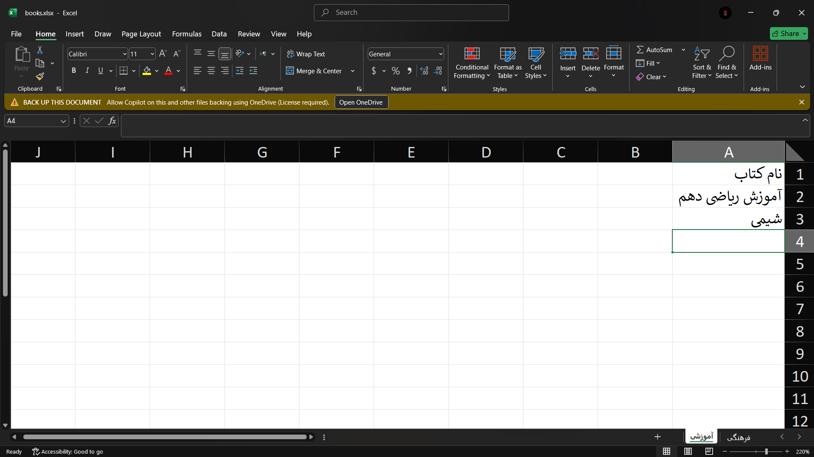
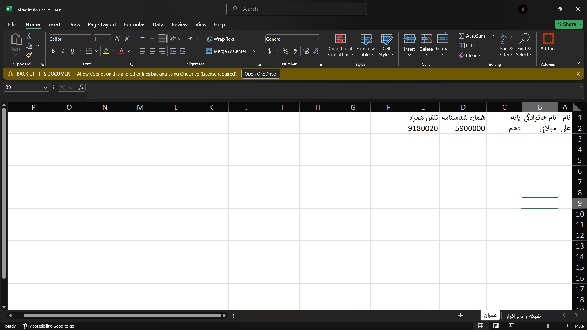

# 📚 Library System

<div align="center">

[](https://www.python.org)
[](https://fastapi.tiangolo.com)
[](LICENSE)

**سامانه مدیریت کتابخانه مدرسه**

سیستم جامع برای مدیریت کتاب‌ها، دانش‌آموزان و امانات با رابط کاربری مدرن

[نصب](#-نصب-و-اجرا) • [ویژگی‌ها](#-ویژگی‌ها) • [API Docs](http://127.0.0.1:8000/docs)

</div>

---

## 📸 نمایش

<p align="center">
  
  <br>
  <em>نمایش کلی سیستم مدیریت کتابخانه</em>
</p>


## ✨ ویژگی‌ها

- 📖 **مدیریت کتاب‌ها** - افزودن، ویرایش، جستجو و آپلود دسته‌ای از Excel
- 👨‍🎓 **مدیریت دانش‌آموزان** - ثبت و پیگیری با امکان آپلود Excel
- 📋 **سیستم امانت** - ثبت امانت با محاسبه خودکار سررسید
- 🎨 **دسته‌بندی هوشمند** - سازماندهی کتاب‌ها با دسته‌های پیش‌فرض
- ⚡ **کش Redis** - جستجوی سریع‌تر با پشتیبانی graceful fallback
- 📊 **گزارش‌گیری** - خروجی CSV از امانات با فیلترهای متنوع

## 🚀 نصب و اجرا

### نیازمندی‌ها

- Python 3.11 یا بالاتر
- pip (Python package manager)
- (اختیاری) Redis server برای کش

### نصب و راه‌اندازی

```bash
# 1. Clone repository
git clone https://github.com/unh4cked/library-system.git
cd library-system

# 2. نصب وابستگی‌ها
pip install -r requirements.txt

# 3. تنظیمات (اختیاری)
copy .env.example .env
# رمز پیش‌فرض: library

# 4. اجرا
python run.py
```

**سیستم به صورت خودکار:**
- Backend: http://127.0.0.1:8000
- Frontend: http://127.0.0.1:5500
- API Docs: http://127.0.0.1:8000/docs

### تنظیمات پیشرفته

<details>
<summary>اجرای جداگانه Backend/Frontend</summary>

```bash
# Backend only
uvicorn backend.main:app --reload

# Frontend only
cd frontend && python -m http.server 5500
```
</details>

<details>
<summary>تنظیمات محیطی (.env)</summary>

```bash
LIBRARY_PASSWORD=library           # رمز عبور
LIBRARY_REDIS_URL=redis://...      # آدرس Redis (اختیاری)
LIBRARY_DATABASE_URL=sqlite:///... # دیتابیس
```
</details>

## 📊 آپلود اکسل

<p align="center">
  
  <br>
  <em>فرمت فایل اکسل کتاب ها</em>
</p>

<p align="center">
  
  <br>
  <em>فرمت فایل اکسل دانش‌آموزان</em>
</p>


## 🛠️ تکنولوژی

**Backend:**
- FastAPI - وب فریم‌ورک مدرن
- SQLAlchemy - ORM
- Redis - کش (اختیاری)
- Pydantic - اعتبارسنجی

**Frontend:**
- HTML5/CSS3/JavaScript
- طراحی Responsive
- UI مدرن و تیره

## 📝 لایسنس

این پروژه تحت لایسنس [MIT](LICENSE) منتشر شده است.

---

**ساخته شده با ❤️ برای مدیریت بهتر کتابخانه‌های مدرسه**
